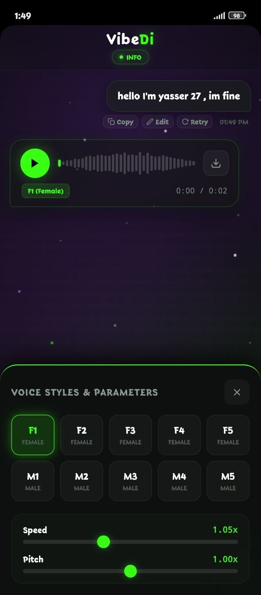
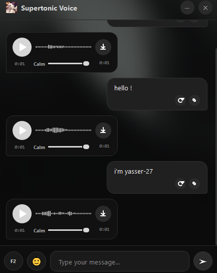

<p align="center">
  
  <h1 align="center">Supertonic Voice </h1>

</p>


[](https://github.com/yasser-27)
[](https://github.com/yasser-27)
[](https://github.com/yasser-27)
[](https://github.com/yasser-27)

**Supertonic Voice** is a premium, fully offline desktop Text-to-Speech (TTS) application featuring a highly refined, modern glassmorphism dark theme UI. Built with **PySide6** and powered by local **ONNX AI Speech models**, it provides instant, natural-sounding voice message generation and live interactive reading without sending any data over the internet.

It seamlessly integrates a modern chat interface, a high-speed bilingual autocomplete helper, and a Chrome extension to let you listen to and generate voice messages straight from your web browser with a single click.

---

<div align="center">

  <!-- الشارات (Badges) -->
  <a href="https://github.com/YASSER-27/Supertonic-Voice/releases/download/1.2.0/SuperVoiceSetup.exe">
    
  </a>
  &nbsp;
  <a href="https://github.com/YASSER-27/Supertonic-Voice/releases/download/1.2.0/Super.Di7.apk">
    
  </a>

  <br><br>

  
  
  

</div>

---

## Features

| Feature | Description |
| :--- | :--- |
| ** Premium Chat UI** | A gorgeous glassmorphism dark-themed conversation window showing sent text bubbles on the right and synthesized voice bubbles on the left. |
| ** Interactive Karaoke Reader** | The **"Read Here"** button highlights the text word-by-word with a beautiful highlight effect in real-time as the audio plays. |
| ** Local AI Voice Generation** | Instant, offline speech synthesis with 10 high-quality voice profiles (5 female and 5 male) using local ONNX neural models. |
| ** Bilingual Autocomplete** | High-speed, bilingual (English & Arabic) suggestion chips powered by `fast-autocomplete` with standard `Tab` completion support. |
| ** Google Chrome Extension** | Fully integrated extension supporting context menus. Select any text on a webpage, right-click, and send it directly to the app to read or speak. |
| ** Save & Download** | Fast wave visualization with seek bars, play/pause controls, and instant `.wav` download option to save generated speech anywhere. |
| ** Zero Permission Errors** | Relocated all temporary output storage to the user's `LocalAppData` path, avoiding Windows privilege issues (`WinError 5 Access Denied`) when installed in `Program Files (x86)`. |

---


### Option 1: Run from Source (For Developers)

#### 1. Clone & Navigate to Folder
```bash
git clone https://github.com/YASSER-27/Supertonic-Voice.git
cd supertonic-voice
```

#### 2. Install Dependencies
```bash
pip install -r requirements.txt
pip install fast-autocomplete pylev
```

#### 3. Run the Main Application
```bash
python main.py
```

---

##  Installing the Google Chrome Extension

1. Launch Google Chrome and navigate to `chrome://extensions/`.
2. Enable **Developer Mode** by toggling the switch in the top-right corner.
3. Click **Load unpacked** in the top-left corner.
4. Select the `chrome_extension` folder located inside the Supertonic Voice project directory.
5. Highlight any text on a webpage, right-click, select **Supertonic Voice**, and choose **📖 Read Here** or **🎙️ Generate Voice**!

---

##  About the Author

Created and engineered with passion by **Yasser (yasser-27)**:
* **GitHub**: [@yasser-27](https://github.com/yasser-27)
* **Download**: [Supertonic Voice Download](https://github.com/YASSER-27/Supertonic-Voice/releases)

---

##  License

the MIT License 
